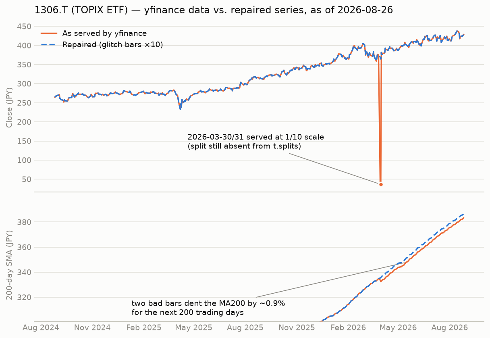

# yfinance-split-guard

Detect broken stock-split adjustments in [yfinance](https://github.com/ranaroussi/yfinance) price data — before they silently wreck your moving averages, backtests, or ML features.



## Why

yfinance is a fantastic free tool, but its split adjustment can fail in (at least) three distinct ways, all observed on real Tokyo Stock Exchange tickers as of August 2026:

| Pattern | Example | What happens |
|---|---|---|
| **Unrecorded split** | 1306.T (1:10 on 2026-03-31) | `Ticker.splits` is empty; history isn't adjusted |
| **Recorded but not applied** | 8227.T (3:1 on 2026-02-19) | The split is in `Ticker.splits`, yet adjusted prices still contain the 3× jump (which actually lands one day *before* the recorded ex-date) |
| **Glitch bars** | 1306.T (2026-03-30/31) | A few bars are served at the wrong scale, then the series snaps back |

None of these raise an exception. A single bad bar poisons a 200-day moving average for 200 trading days. The full story, with the detection logic and a guarded correction layer, is in the accompanying article (link below).

## Usage

```bash
pip install yfinance
python detect_missing_splits.py 1306.T 8227.T AAPL
```

Sample output (2026-08-26):

```
1306.T: 1 suspicious discontinuity
  2026-03-30  ratio=0.0984  factor~10  -> GLITCH
8227.T: 1 suspicious discontinuity
  2026-02-18  ratio=0.3364  factor~3   -> NOT_APPLIED
```

The scanner flags daily close-to-close ratios outside `[0.55, 1.8]`, snaps each jump to the nearest plausible split factor, and classifies it as `GLITCH` (scale reverts within a few bars), `NOT_APPLIED` (a recorded split exists within ±5 days), or `UNRECORDED` (no matching split in `Ticker.splits`). Tune the thresholds at the top of the script for micro-caps or crypto, where real moves can be larger.

## Files

- `detect_missing_splits.py` — the detector (yfinance is the only dependency)
- `make_chart.py` — renders `chart.png`, the before/after comparison for 1306.T
- `chart.png` — the resulting figure

## Article

The write-up behind this repo: [When yfinance Silently Breaks Your 200-Day Moving Average: Two Split-Adjustment Bugs and How to Detect Them](https://dev.to/fumisato407crypto/when-yfinance-silently-breaks-your-200-day-moving-average-two-split-adjustment-bugs-and-how-to-34d0) (dev.to).

## License

MIT
